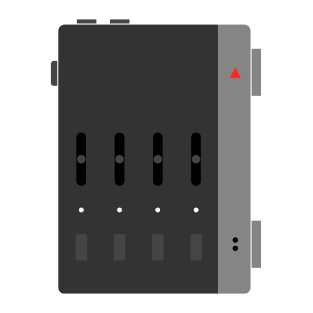

# SP-1 Development documentation

Development documentation for the SP-1 stem player by Teenage Engineering.

## Developing for the SP-1 stem player

The SP-1 is an unreleased [stem player](https://llllllll.co/t/te-stem-player/66795) designed by Teenage Engineering and now also a very fancy nRF52840 development board. Since it was never release and they provide no documentation or support, we have to write it ourselves.

If you want to develop new firmware for your SP-1, this repo is here to help you! 

Please have fun with this device but also read the disclaimer at the bottom of this page!

💾👷🏻‍♂️

## Hardware overview

The main MCU in the SP-1 stem player is an [nRF52840](https://www.nordicsemi.com/Products/nRF52840) by Nordic, a 32-bit ARM Cortex-M4 chip running at 64 MHz.

#### Todo:
- overview of chips and how they communicate with the MCU
- links to datasheets of all chips

## Setting up for development

#### Todo:
- SWD and debugger setup instructions
- toolchain setup instructions
- setup examples of all peripherals

## Uploading new stems

#### Todo:
- documentation of the stem upload protocol

## Compiling for the SP-1 bootloader

*How to compile new firmware for your SP-1 so it can be used with the TE bootloader.*

#### Todo:
- memory layout and linker setup instructions for bootloader
- info about setup of clocks and main peripherals for use with bootloader 

## Uploading firmware

Thanks to the hard work by the incredibly talented engineers at Solderless, you can now update the firmware of you SP-1 without even opening up the device!  

Please use the web based updater tool created by the Solderless dev team and follow the instructions at [link to updater tool here].

The updater works with Google Chrome or any other browser that supports web serial.

## Discussion

For general discussion about the Teenage Engineering stem player, please see the original thread at [llllllllines](https://llllllll.co/t/te-stem-player/66795).

For development discussion and technical discussion about the SP-1, come join us on [link to the TE SP-1 dev discord here].

## Disclaimer 

> **⚠️ WARNING ⚠️**  
>
> I have tried my best to make sure all information on these pages is correct, and as far as I know everything is.
>
> This doesn't mean you should trust it blindly!  I might for example have omitted essential information that is obvious to me. If you modify your stem player based on the information provided here, make sure you know what you are doing to avoid damaging or bricking your hardware!  
>
> I encourage everyone to learn and experiment, but this documentation is primarily meant for developers who at least have some experience developing for embedded device and who understand the risks involved in hacking a device like this. 
>
> **Please have fun but also use at your own risk!**
